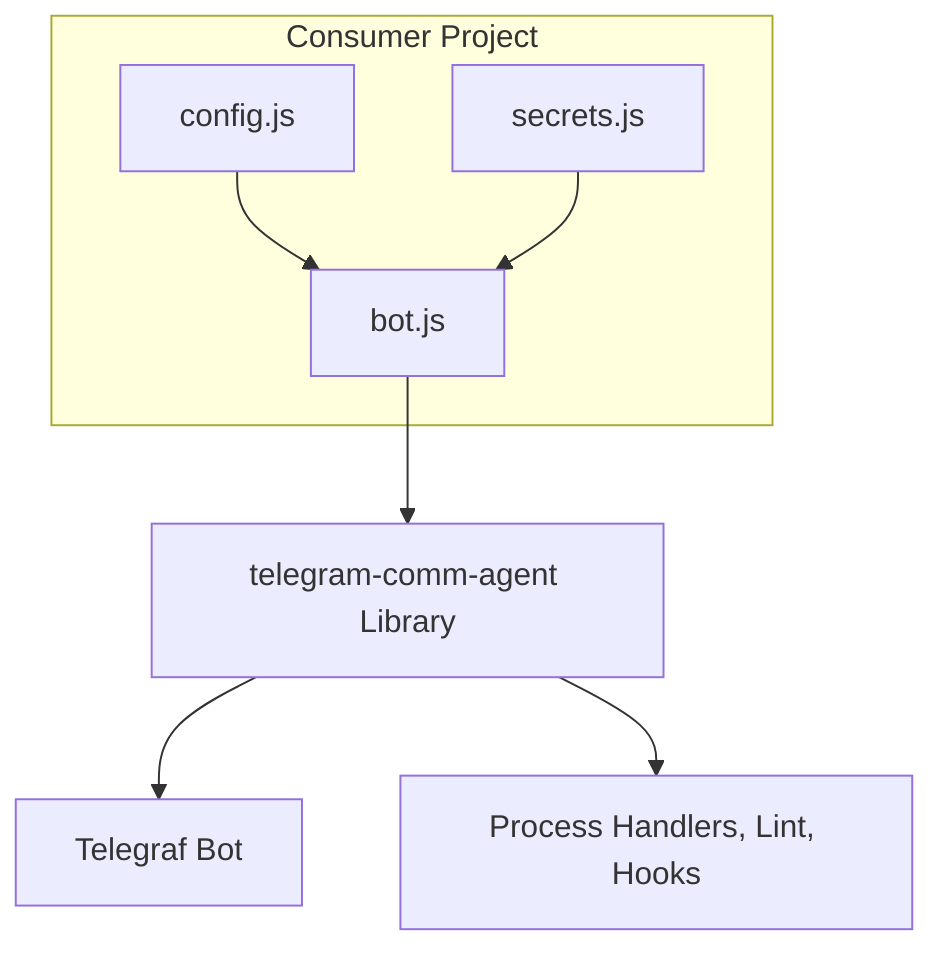
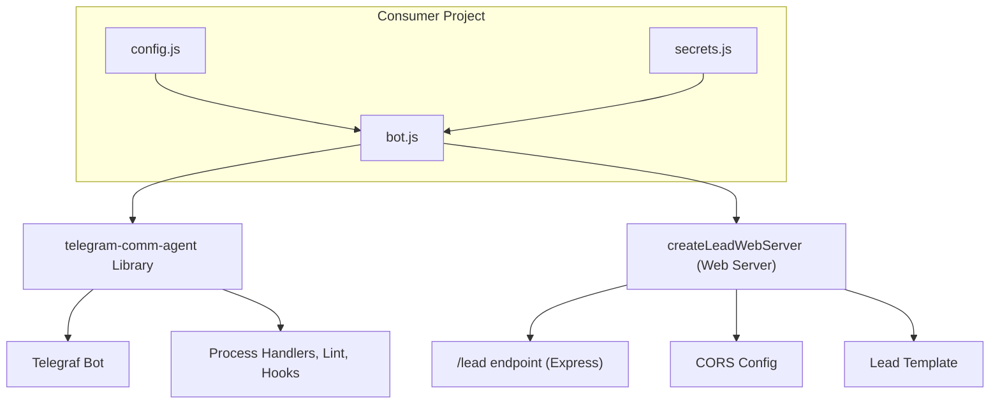
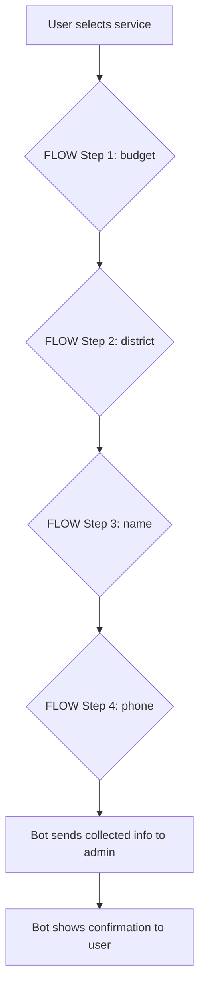

# telegram-comm-agent

[](https://github.com/OrithmicSoftware/telegram-comm-agent/actions/workflows/lint.yml)
[](https://github.com/OrithmicSoftware/telegram-comm-agent/actions/workflows/test.yml)

A reusable, fully-configurable Telegram communication agent bot library for Node.js, based on Telegraf. Designed for rapid onboarding, localization, and integration in any project.

---

## Features
- Data-driven, step-by-step flow (no logic in consumer)
- All prompts, services, and UI are configurable in `config.js`
- No secrets or business logic hardcoded
- Handles process signals, lint, and test hooks internally
- Easy to integrate in any Node.js project
- Includes onboarding config and secrets examples

---

## Quick Start

1. Copy `config.example.js` and `secrets.example.js` from this repo to your consumer project.
2. Fill in your values in `config.js` and `secrets.js`.
3. Install dependencies:
   ```sh
   npm install telegram-comm-agent telegraf dotenv
   ```
4. Minimal consumer entrypoint:
   ```js
   const { createCommAgent } = require('telegram-comm-agent');
   const config = require('./config');
   const secrets = require('./secrets');
   const bot = createCommAgent(config, secrets);
   bot.launch();
   ```

---

## Architecture Diagram




---

## Step Flow Guide
---

## Web Server & /lead Endpoint

The library provides a built-in Express web server for receiving web leads via a POST request to `/lead`. This is useful for integrating web forms or external sources with your Telegram bot workflow.

**Key features:**
- Accepts POST requests at `/lead` (JSON: `{ name, phone, message }`)
- Uses the lead template and admin notification logic from your config
 - Can be launched from your consumer's `bot.js` using `createLeadWebServer`

**Example usage:**
```js
const { createLeadWebServer } = require('telegram-comm-agent/web-server');
const config = require('./config');
const secrets = require('./secrets');

createLeadWebServer({
  ...secrets,
  formatLead: ({ name, phone, message }) =>
    config.STRINGS.LEAD_TEMPLATE(
      { service: 'web', name, phone, message },
      { username: 'webform', first_name: 'Web', id: 0 }
    ),
  port: process.env.PORT || 3000,
  botInstance: bot
  // optionally: cors: makeCorsConfig(secrets.CORS_ORIGINS)
});
```

**CORS Configuration:**
CORS origins should be provided by the consumer via `secrets.CORS_ORIGINS` (env or secrets file). The library will build the CORS configuration from `secrets.CORS_ORIGINS` if you don't provide an explicit `cors` option.

Example (env):
```env
CORS_ORIGINS=https://yourdomain.com,https://other.example
```

If you prefer, call the helper yourself:
```js
const { makeCorsConfig } = require('telegram-comm-agent/cors');
createLeadWebServer({ ...secrets, cors: makeCorsConfig(secrets.CORS_ORIGINS) });
```

Notes:
- For test environments, pass `port: 0` — the function returns the Express `app` without starting a listener so tests can use `supertest(app)` without leaving open handles.
- The bot exposes a test-friendly `handleUpdate(update, ctx)` helper: tests can pass a `ctx` object (with `reply` and optional `telegram.sendMessage`) and the library will use it instead of the real networked bot.

---

## Step Flow Guide



The bot uses a fully data-driven step flow, defined in the `FLOW` array in `config.js`. Each step collects a piece of information from the user, and the prompts and order are fully configurable.

**Example FLOW (from config.example.js):**

```
FLOW: [
  { field: 'budget', prompt: 'Please enter your budget:' },
  { field: 'district', prompt: 'Please enter your preferred district:' },
  { field: 'name', prompt: 'Please enter your name:' },
  { field: 'phone', prompt: 'Please enter your phone number:' },
]
```

---

## Configuration & Environment Variables

Copy `config.example.js` and `secrets.example.js` to your project and fill in your values:

```
BOT_TOKEN=your_bot_token_here
ADMIN_CHAT_ID=your_admin_chat_id
AGENT_CHAT_ID=your_agent_chat_id
FORWARD_TO_AGENT=ask
```

- `BOT_TOKEN`: Telegram bot token
- `ADMIN_CHAT_ID`: Telegram chat ID for admin notifications
- `AGENT_CHAT_ID`: Telegram chat ID for agent forwarding
- `FORWARD_TO_AGENT`: 'no', 'all', or 'ask'

All user/admin-facing strings, menu labels, and step flow are in `config.js`.
To localize or update UI text, edit `config.js`.

---

## API

### createCommAgent(config, secrets)
- `config`: Object with STRINGS, SERVICES, BUTTONS, etc.
- `secrets`: Object with BOT_TOKEN, ADMIN_CHAT_ID, AGENT_CHAT_ID, FORWARD_TO_AGENT, etc.
- Returns: Configured Telegraf bot instance

---

## Testing

- Run `npm test` to execute the test suite.

---

## License
MIT
